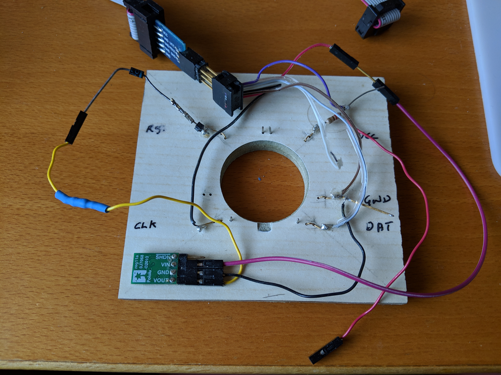

# SMBeeHive dock story

I designed an electronic bee-badge a couple of years ago as a fun project to make to help teach surface mount soldering and embedded programming at maker spaces. I'm open sourcing the design and construction guidelines so anybody can acquire the tools and parts to set up a workshop. The badge parts cost is only about £2 each in quantities of 100. 

The bee has a tiny 6-pin microcontroller to monitor the switch and control the LEDS but the problem was, commercial programmers are expensive and from experience I found it difficult to connect the programmer to the bees programming contacts with the necessary reliability. I made my own very crude but effective jig but it wasn't something I wanted to task other people to make. I needed to design a worthy programmer as a project in its own right.

The bee badge. Its programming contacts are on its feet. The microcontroller is located on its neck.  The PCB measures 43 x 57mm.    You can find the project documentation [here](https://milelo.github.io/smbee/){:target="smbee"}. | {:width="172px"} {:width="170px"}
The first setup for programming the bee, I couldn't get reliable connections to the programming pads. I originally used a PIC10LF322T microcontroller but it only had 128bytes of flash memory, my program soon got too big. I switched to an ATtiny10 with the same pin-out but the program needed re-writing. The ATtiny10 has a larger 1k byte flash capacity, it also uses the avr-gcc compiler, potentially making it Arduino® tool-chain compatible. | 
You have probably heard of breadboards sold to connect components for prototype electronic designs? Well this is a piece of floorboard made into a jig for the bee. It is more true to the original concept of a breadboard from which the name was derived than the modern matrix boards, literally a wooden board for cutting bread with nails in it as mounts for the connections between components. The components in those days probably included valves. At that time integrated circuits of the complexity, sophistication and tiny size of a computer on a chip like the ATtiny10 were probably only conceived of in the imagination of a few visionary science fiction writers. | 
The jig connected up. I originally had the jig connected to a commercial [AVRISP MkII programmer](https://www.microchip.com/DevelopmentTools/ProductDetails/PartNO/ATAVRISP2){:target="avrisp"}, its shown here with a USBASP programmer module plugged into a USB port. The USBASP with ribbon cable can be bought for a few pounds off ebay. It needs to be re-programmed to support the TPI protocol used by the ATtiny10 and support its 12V programming mode. If you buy two modules, one can programme the other with the modified firmware, its no harder than programming the bee. | 
My first jig design attempts. I used Autodesks Fusion 360 3D CAD for the design, I did a 1 day introductory course on using Fusion at [Leigh Hackspace](http://www.leighhack.org/). I made the jig at the [The Making Rooms](https://makingrooms.org/) Blackburn, its four layers are laser cut from clear acrylic, there are voids cut in the middle layers for the components and wiring. The first design was too cramped. For the second I enlarged the design and made more efficient use of the uncut material sizes. | 
I bent gold-plated phosphor bronze wire to make the contacts. I already had the wire but couldn't find a good source for others to buy and I decided it was too difficult to wire up. | 
I'd been resisting making a custom PCB because I was struggling to find a cheap manufacturer for the required PCB size. The first PCB I had made was expensive but I got a valuable tip from [Tom](https://twitter.com/t_mac_p) from The Making Rooms, he used [ELECROW](https://www.elecrow.com/pcb-manufacturing.html) to manufacture the [CodeBug](http://www.codebug.org.uk/) PCBs, I could get the PCB's made for a little over £2 each from China including shipping. The design changes weren't too difficult. I removed the wiring and contact voids and added some holes for some commercial sprung contacts and replaced the cable clamp with a connector. I also modified the latching mechanism so the retaining arm is kept attached when unlocked to remove the bee. The full parts cost is about £12. | 
Bottom view. The rectangle of complicated circuitry on the right is a separate module soldered to the main PCB. It converts the 5V from the USB connector to 12V required for programming. I later added the horizontal strip with a screw you can just see above the bee battery holder its a safety feature to stop the bee from being inserted with its battery fitted, charging primary cells isn't recommended. | 
The acrylic parts hot off the laser cutter, still covered with the protective film. | 

Finally a design I'm happy with. Its affordable, not too difficult to make and looks good. The button replicates the inaccessible on-off button on the bee so the programming jig can just be used to power the bee when running the firmware. The retaining arm holding the bee onto the contacts is locked down with the sprung catch cut from the acrylic, the release button can be seen to protrude slightly from the near side of the jig:

## Laser cutting the jig
<iframe width="750" height="422" src="https://www.youtube.com/embed/XsH8NMKwvSg" frameborder="0" allowfullscreen></iframe>
