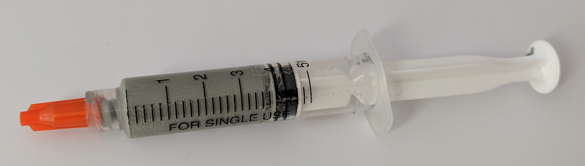
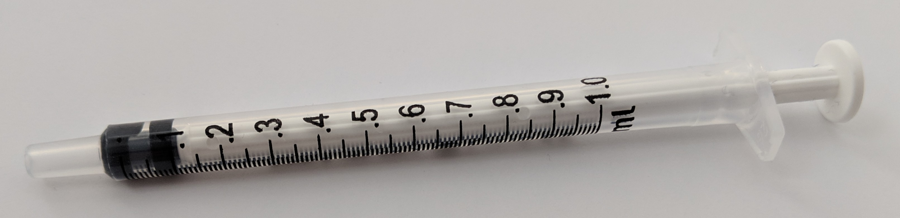
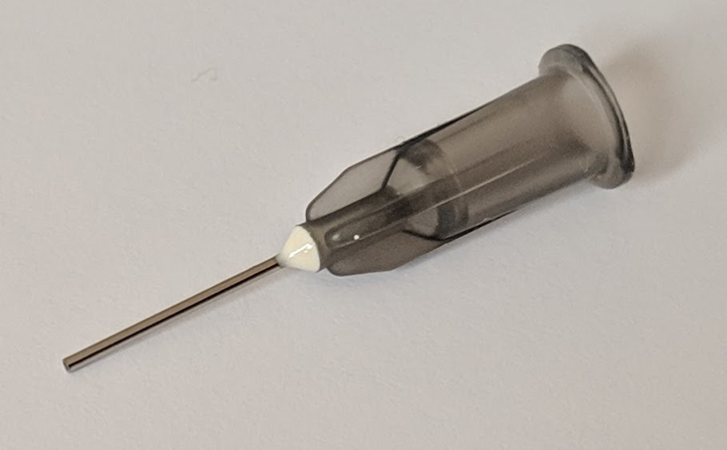
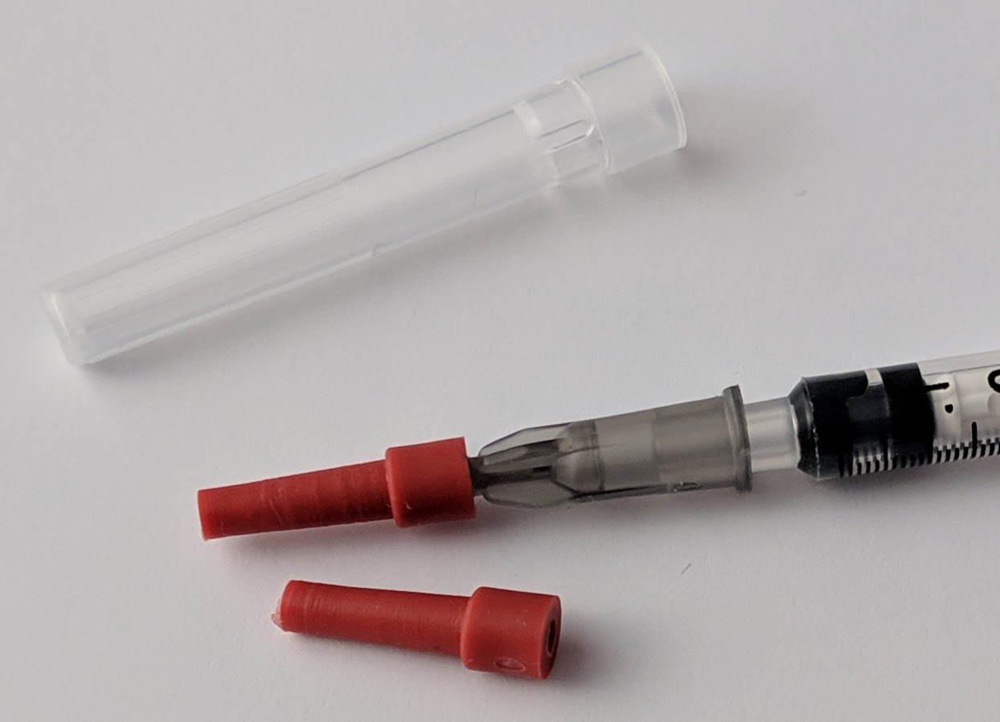
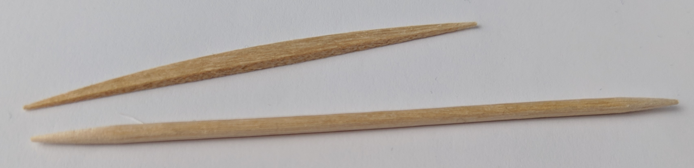
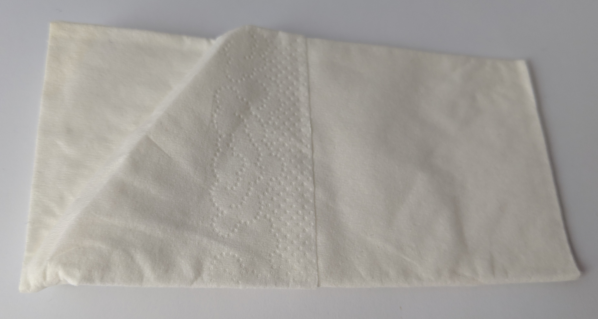
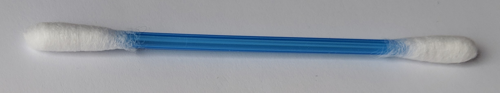
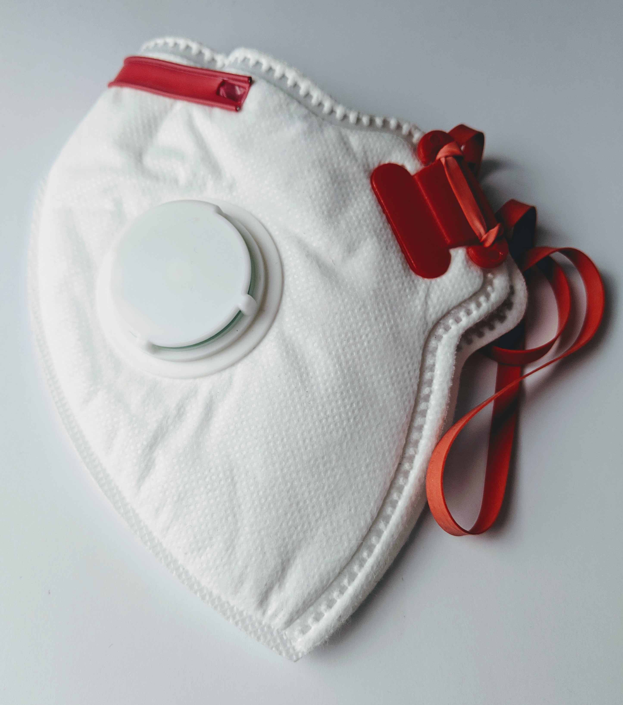
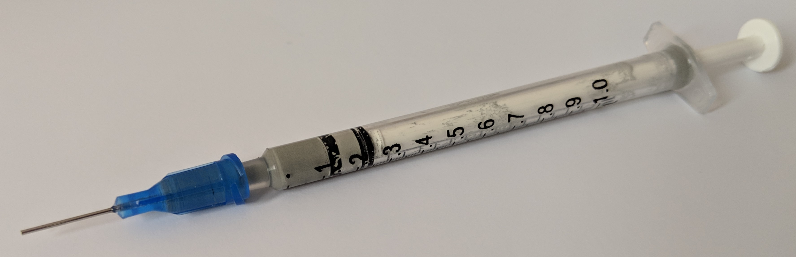

This is a description of the consumables you need. For part codes, manufacturers, supplier and cost information see:

* [Consumables summary spreadsheet](
https://docs.google.com/spreadsheets/d/1pC-4M-7qa12mT0QL2S9FdDb4QyRmq4kYofQHElQal1s/edit#gid=574478259){:target="SMBee-spreadsheet"}

## Table of contents
{: .no_toc .text-delta }

1. TOC
{:toc}
---

## Parts summary

| Item | Image | Description
-|:-:|-
Solder paste. 5g as supplied | {:width="800px"} | To solder the components to the PCB. Lead free, SAC305 alloy (217ºC melting), No clean flux is recommended.
Syringe | {:width="600px"} | 1ml Luer slip syringe. This is required to dispense the solder paste. See the preparation guidelines below.
Dispensing needle | {:width="150px"} | 22G dispensing needle - (blunt needle). Luer slip with stainless cannula.
Needle cover or seal | {:width="200px"} | A cover or seal will protect the needle and stop unwanted leakage. Only one or the other can be fitted.
Wooden cocktail sticks or tooth picks | {:width="200px"} | Very helpful to make minor adjustments to solder-paste like removing from between tracks.
Paper tissue or fine lint-free cloth | {:width="150px"} | Helpful for cleaning the syringe-needle or excess solder-paste from the PCB.
Cotton buds | {:width="150px"} | Maybe helpful to selectively clean off solder paste.
Fume mask | {:width="100px"} | A P3 rated mask will provide protection from inhaling solder fumes. Particularly helpful if you have health concerns or have extended exposure.

## Dispensing syringe preparation

These are critical to both accurately placing and applying the correct amount of solder paste to the PCB before component placement.

Add a small amount (up to 0.3ml) of solder paste from its supplied container, to the 1ml syringe. Try to eliminate or at least minimize the amount of air in the syringe with the solder paste, air is compressible making the plunger springy and the flow of paste, more difficult to control.

A prepared syringe with dispensing needle.  Using a small 1ml syringe minimizes force is required to dispense to the paste.  For applying the paste to the PCB, I've found a 22G dispensing needle gives the best results. | {:width="400px"}

## Choosing solder paste

The choice of solder paste is critical for ease of use and final results, there are many formulations so you need to be careful when choosing one. Unlike solder wire, hobby suppliers of electronic components don't usually stock solder paste, you will probably have purchase the paste from industrial suppliers, who offer a vast range of (unsuitable) options so you need to know what to buy.

Choose solder-paste (like solder-wire if you need it) with the following properties:

* Lead-free for low toxicity and [RoHS]{:target="rohs"}
compliance.
* SAC305 alloy - 96.5 % tin, 3% silver, & 0.5% copper. With a melting temperature of 217ºC this is higher than for leaded types but flows well and is still fairly easy to use.
* No clean flux - the flux leaves a residue that is clear, non-conductive and fairly hard. This will typically be a rosin based flux.

There are lead-free alloys containing bismuth with a lower melting temperature than SAC305 but from my experience, they have poor wettability.

Most solder paste needs to be stored at low temperature to keep it mixed but you need to return it to room temperature so the paste is fluid enough to dispense. I keep mine in my fridge. The syringe can be removed half an hour or so before use then returned after use. I keep my solder paste like this. It is well past its expiry date but still performs well.

All the bee badge components are soldered with *solder paste* rather than solder wire. Hot air is used to flow the solder paste.

>Solder paste is made of fine solder metal particles suspended in a viscous flux. It is used in surface-mount soldering because it can be applied to the bare PCB using printing techniques and to some extent will hold the small surface mount components once placed, before the assembly is heated to melt or flow the solder-paste. The solder particles are a metal alloy designed to melt at a suitable temperature with good mechanical and electrical properties to bond to the components.

>The flux is designed to protect the solder from oxidation during soldering which would stop the melted solder from flowing and interfere with its mechanical properties once set. The residue the flux leaves behind after it is flowed is also an important property. Some fluxes mainly the activated types also help clean the surfaces to be soldered however the residue needs cleaning off, this flux type isn't required to solder pre-tinned or gold finished surfaces so choose the usually rosin based no-clean types. Flux will discolour if it is held at a high temperature for too long and burn, char above ~370ºC.

## Fume mask

Soldering fumes are designed to have low-toxicity (if you choose the correct solder type). The fumes are still an irritant and have long term exposure risks. Like with all fumes, minimize your exposure.

If you have health concerns wear a P3 rated fume mask particularly if you are asthmatic.

[Kapton tape]: https://en.wikipedia.org/wiki/Kapton
[RoHS]: https://en.wikipedia.org/wiki/Restriction_of_Hazardous_Substances_Directive

