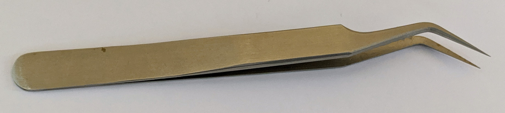
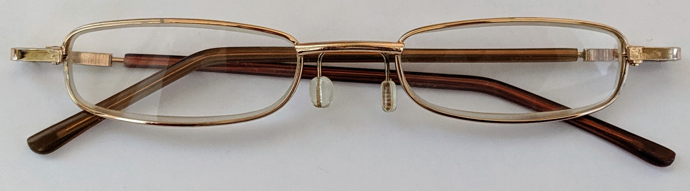
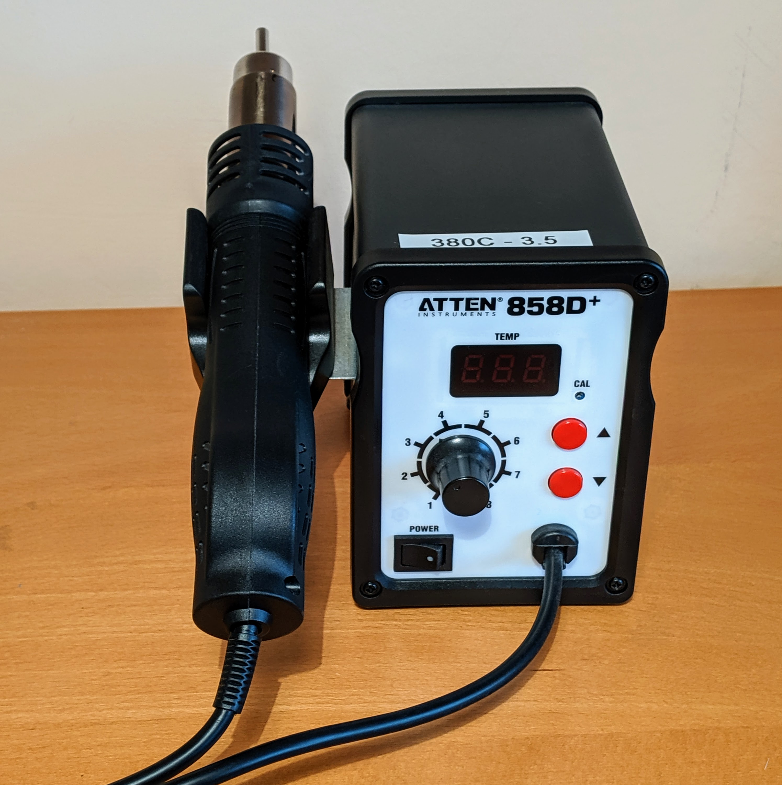
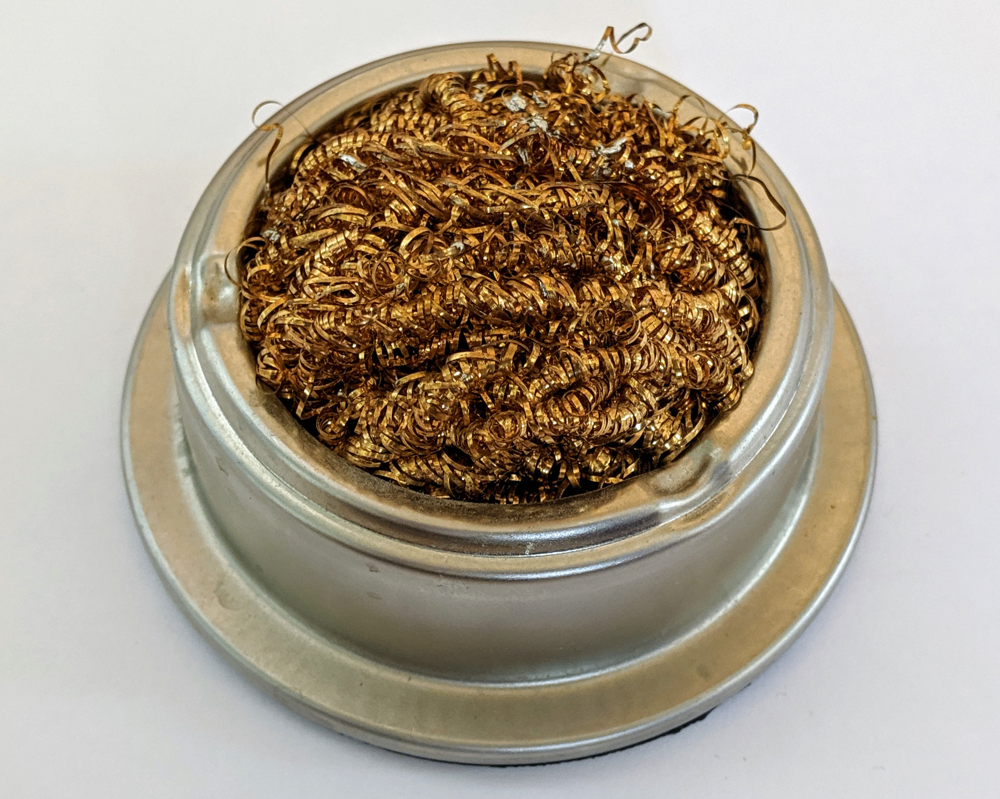
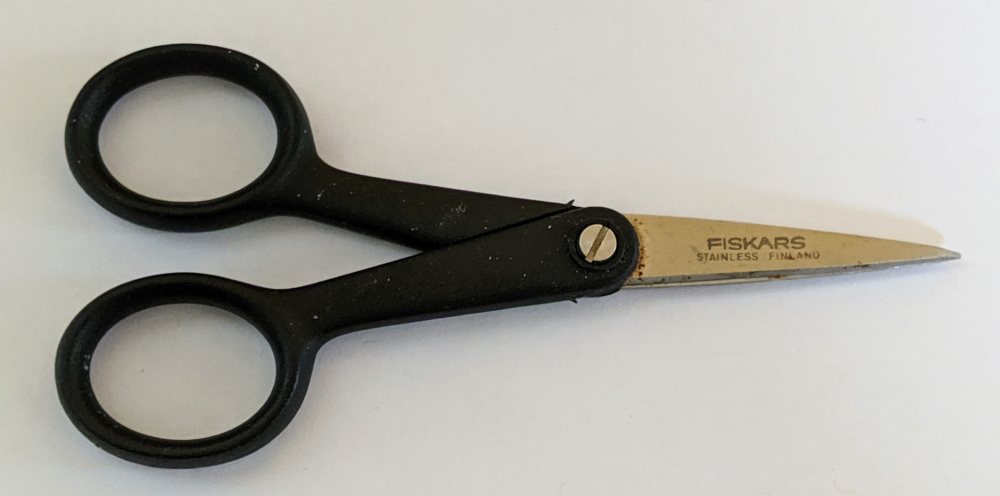
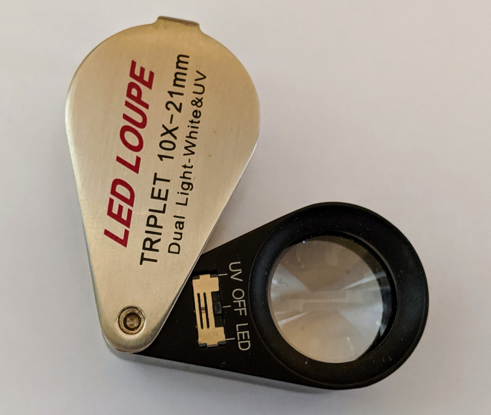
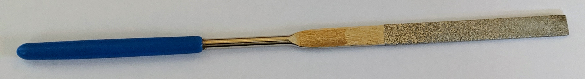
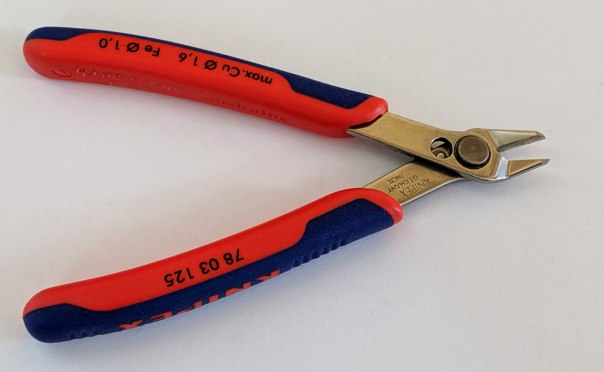

While the equipment costs aren't high, it isn't an outlay most individuals are likely to want to make for a one-off task. Search for a local hack-space or fab-lab who will likely give free access to the equipment.

## Table of contents
{: .no_toc .text-delta }

1. TOC
{:toc}
---

## Equipment summary

For detailed part codes, manufacturers, supplier and cost information see:
* The [Equipment summery spreadsheet]{:target="SMBee-spreadsheet"}

| Item | Image | Description
-|-|-
Fine-tipped tweezers |  | Essential for handling surface-mount components. Ensure they close at the tips.
Reading glasses (x3.5 or x4.0) |  | Essential for most people to work with the small components. Can be worn over regular glasses.
Hot air station |  | Provides hot air to melt the solder paste to solder the surface mount components. Fit the small diameter tip ~5mm.
Soldering iron |  | Easier to use to melt the solder paste on the brooch pin and battery holder.
Soldering tip cleaner |  | A damp sponge or brass-wire pad to clean the soldering iron tip when hot.
Soldering Smoke Absorber |  | Can help filter the solder fumes.
Small scissors |  | Nail or sewing type scissors for cutting the Kapton tape.
10x LED Loupe or similar |  | Optional, a helpful aid for close inspection.
Needle file, emory-paper or similar |  | To remove the PCB mouse-bites if the PCB requires finishing.
Small side-cutters |  | To remove the PCB panel mounding tabs  if the PCB requires finishing. This is an expensive pair, a cheap pair is sufficient.

## Hot air station

A professional soldering station with hot air station can set you back hundreds of pounds however there are
a few low cost and perfectly serviceable options for low volume work.

I use an ATTEN 858D, this is a relatively inexpensive unit of which there are many chinese clones available.

[EEVblog review of ATTEN 858D]{:target="ATTEN-858D"}

There are other relative inexpensive units like this [Duratool hot-air station](https://cpc.farnell.com/duratool/d03167/hot-air-smd-rework-station/dp/SD02123){:target="duratool"}, I haven't had the opportunity to try them. This unit is only rated at 300w as oppose to the 700w of my ATTEN unit so may be slower.

<!--
### Butain powered hot air guns

Some gas soldering irons have a catalyzing nozzle attachment as an alternative to the soldering bit. I have not tried to
use these for surface mount soldering however it may be possible to use one using the distance from the component to
adjust the temperature. Experimentation required.
-->

## Soldering Smoke Absorber

## Reading glasses

Although there are all manner or magnifying accessories available for ammeter and professional, I've found the most useful to be a pair of cheap off-the-shelf reading glasses either 3.5x or 4x magnification available from shops like supermarkets and drug stores. If you already wear glasses, the reading glasses can usually be worn over the top of your regular glasses for the short duration you will need them.

Cheap Digital microscopes have their uses but are unsuitable for real-time work because of the display lag.

Whatever you use for magnifying, you will need your hands-free for other tasks.

## Soldering iron

The bee badge battery-holder and brooch-clasp have a high thermal capacity; they take a long time to heat up to the temperature necessary to melt and flow the solder paste. In theory it should be possible to solder these with hot air however the time to get these components up to temperature and finding the correct temperature and air-flow rate settings to achieve this is awkward and you risk scorching the PCB. I've found it much easier and got consistently good results heating the components and melting the solder paste with a conventional soldering iron as I'll detail.

The soldering iron isn't critical to getting good results, a cheap soldering iron should suffice as long as it has a clean tinned tip so it can transfer its heat efficiently and get hot enough to heat the metal components to melt the solder paste. Apply the soldering iron so the melted solder wicks under the component but not too long that the flux gets scorched and discoloured.  Re-tin the tip each time, before it is applied to maximize heat transfer and provide a source of solder to supplement the paste. Use only a small amount of paste.

Note:
* A damp sponge or brass-wire pad is required to clean the tip.
* Solder wire is required to tin the soldering iron tip, preferably with the same alloy and flux type as the solder paste.

[Equipment summery spreadsheet]: https://docs.google.com/spreadsheets/d/1pC-4M-7qa12mT0QL2S9FdDb4QyRmq4kYofQHElQal1s/edit#gid=802410893
[EEVblog review of ATTEN 858D]: https://www.youtube.com/watch?v=vva2t21sOAs

