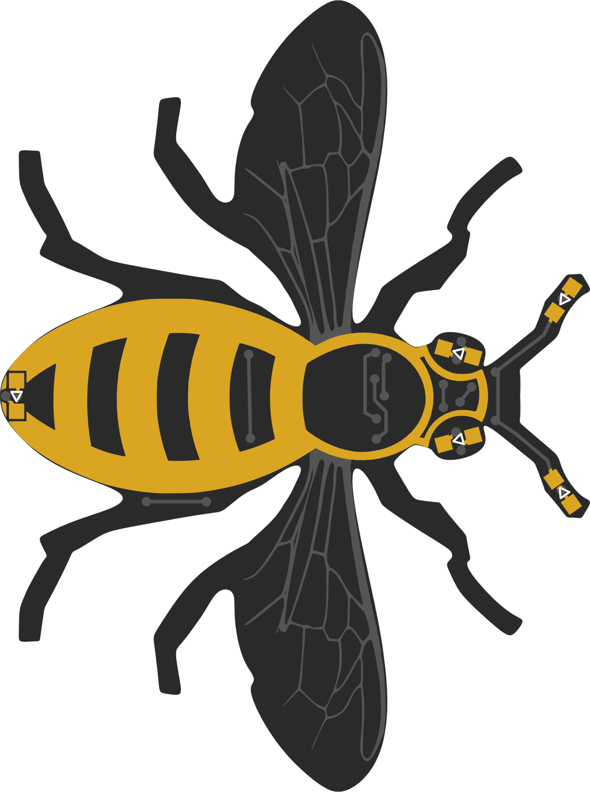

This is a description of the parts you need. 

For part codes, manufacturers, supplier and cost information see:
* [Bee Parts Spreadsheet]{:target="SMBee-spreadsheet"}.
* [PCB Suppliers & Cost Spreadsheet]{:target="SMBee-spreadsheet"}.

The bee parts:

| Part | Image | Description
-|:-:|-
Printed Circuit Board (PCB) | {:width="300px"} | A standard double-sided commercially manufactured PCB with black solder resist and gold plated finish. Unusually is has a complex outline and exposed gold-plated copper areas. 57 x 43 x 1.6mm. Its easy to order the PCB from a manufacturer, see the GitHub repository: [SMBee PCB]{:target="SMBee-PCB"}.
ATtiny10 MCU | {:width="60px"} | A surface-mount low power 6 pin flash-programmable microcontroller with sleep mode, timers, pulse-width modulators and many other features. 3mm long.
5 Light Emitting Diodes (LEDs) | {:width="100px"} | 2.0 x 1.2mm high-efficiency surface-mount Light Emitting Diodes. All are very low profile particularly for the antenna and sting are only 0.4mm thick. The eye LEDs are 0.75mm thick (shown).
Tactile switch | {:width="50px"} | A very low profile tactile switch. Contact is made while it is pressed. 4.8 x 4.8mm.
Brooch pin | {:width="100px"} | A brooch pin with rolling safety clasp.
Coin cell holder | {:width="70px"} | A surface mount coin cell holder.
CR1220 coin cell | {:width="60px"} | A 3V lithium primary (non rechargeable) coin cell. 12mm Ø x 2.0mm.

[PCB Suppliers & Cost Spreadsheet]: https://docs.google.com/spreadsheets/d/1pC-4M-7qa12mT0QL2S9FdDb4QyRmq4kYofQHElQal1s/edit#gid=567507746
[Bee Parts Spreadsheet]: https://docs.google.com/spreadsheets/d/1pC-4M-7qa12mT0QL2S9FdDb4QyRmq4kYofQHElQal1s/edit#gid=1645088434
[SMBee PCB]: https://github.com/milelo/SMBeeKiCad
