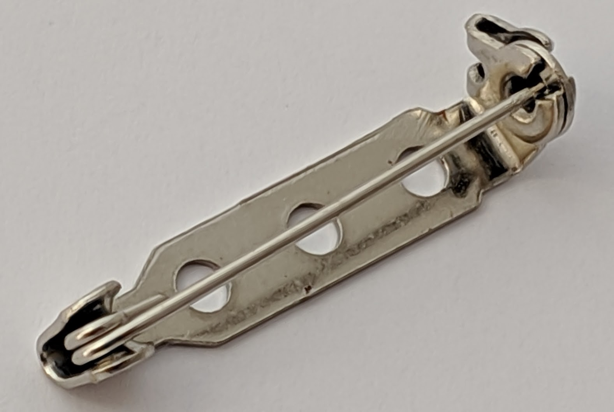

## Table of contents
{: .no_toc .text-delta }

1. TOC
{:toc}

## PCB preparation

PCB’s from some manufacturers will require finishing. | {:width="440px"}
Cut any support tags off the PCB with small side cutters. File away the perforated edges [(mouse bites)](https://www.allpcb.com/mouse_bites_pcb.html){:target="mbites"} and any rough or sharp edges with a diamond file, emory-paper or similar. | {:width="400px"}
The PCB solder pads can usually be **polished clean with a clean, dry cotton cloth or similar**. Minor surface contamination shouldn't cause a problem. Dampen if necessary, don't use a cleaner that is abrasive or leaves a residue. | {:width="400px"}

## Component preparation

SMD components need to be removed from the packaging ready for placing onto the PCB after the solder paste is applied, once removed many SMD components are easy to lose and difficult to distinguish from each other like the LED colours so it is important to keep them grouped and labeled. One of the simplest way to do this is to draw circles on a sheet of paper labeled with the SMC types within which the components can be placed. | 
SMD components sold in quantities of >1 are usually packed in cut tape. Peel back the clear film and tip the components onto your prepared surface. | 
I use disposable contact lense packaging to keep SMDs organized, they are easy to see and re-use. | 

You could use the components direct out of their packaging but I think there is a higher risk of stray packaging upsetting your placement.

## LEDs

Start with the top side. Once populated this side can still be layed flat, face down while you work on the bottom side.  Follow the order indicated here for best results.   Start by pasting, placing and flowing just one or two LEDS at once. | {:width="800px"}
The LEDs must be oriented correctly to align with the white screen printing on the PCB. Here green markings on the front and back indicate the cathode (-ve). The cathode could instead be indicated with some other marking. |{:width="800px"}

### Antennae

Apply the solder paste.  The solder will extrude from the needle as a cylinder, this won't usually stick to the PCB pad and can roll off. To avoid this the needle needs to be held at an acute angle, around 60º from the horizontal dragging the edge of the needle very-close or touching the PCB so the paste is forced out between the PCB and needle much like putting toothpaste on a toothbrush.  Control the width of the applied paste by the speed at which you move the tip relative to the plunger force you apply. | {:widthx="800px"}
Lay down a single track of paste on the PCB from one side of a pad to the other along the centre-line of the component but slightly away from the pad edges, the aim isn't to completely cover the pad in solder paste. Better results can be achieved with too little paste rather than too much.  The paste can be applied as a blob but I find this easier, the paste sticks to the PCB rather than collecting on the needle.  For best results try to apply the solder paste in a single quick operation. If you get it wrong, it isn't fatal, wipe it off and start again. Its possible to make minor adjustments with a toothpick or cocktail stick to remove excess paste. | {:widthx="800px"}
Drop the blue LEDs onto the paste, nudge them into position and tap them down slightly, they must to sandwich some of the paste.  When the paste is heated the flux will melt first and spread out on the pad, it should also wick under the components metal terminal (but not its body!) with capillary action before the suspended solder particles melt.   The pads are sized so that the surface tension of the melted solder will have a tendency to pull the components into the correct position.| {:widthx="800px"}

### Flow-soldering the LEDs

Requires:
* Hot air station.
* PCB partial populated with components and corresponding solder paste.
* Heat resistant work surface
* High magnification reading glasses

It is important to get the air flow and temperature correct. Components and the PCB can be damaged by the heat but counter intuitively this can occur because the air temperature or flow rate are too low as well as too high.

Heat or air flow rate too low | The PCB can slowly scorch and discolour, the solder flux can boil off and become ineffective without reaching the desired solder melting temperature.
Flow rate too high | Components can be displaced by the pressure of the air-flow.
Heat too high | Parts can overheat too quickly, potentially without sufficient heat propagation to melt all the solder paste.

Typical flow times:

Component | Heat time |
-|-
first antenna | 30s

The heat capacity of the PCB will mean the first component to be flowed will take a lot longer than the others because the temperature of the PCB will need to be raised before the solder melts. The solder will melt in two distinct sages with characteristic solder paste colour changes. First the flux will melt, it will change colour to a smooth darker grey and spread out, the solder particles will then congeal, melt and turn a bright, smooth, silver.

<table>
<tr><td  width="100%">Apply the heat to the top of the component fairly perpendicular to PCB surface so the force of the air doesn't displace the component. Start with the hot-air nozzle to about 3cm from the component, if necessary, move it closer to increase the temperature.  Once the first component has been flowed redirect the heat to the next, it should take a lot shorter period to melt the paste.</td><td><iframe width="400" height="225" src="https://www.youtube.com/embed/Z6FFAWarQ60" frameborder="0" allowfullscreen></iframe></td></tr>
</table>

### Eyes

Using the same methods for the eyes as the antennae:  Apply the solder paste. | {:width="300px"}
Place and check the LED orientation.   Then flow the solder.| {:width="300px"}

### Sting

Apply the paste for the sting LED, be very careful here, use the paste sparingly and keep the paste away from the surrounding metal to avoid contaminating it. | {:width="800px"}
Place the red LED, check its orientation and flow the solder. | {:width="800px"}

Turn the PCB over to work on the bottom side.

## Microcontroller

Apply the paste for the microcontroller. As long as you don't apply too much paste, its ok if the paste spans the pads, the component will wick it up. | {:width="400px"}
Place the component. I've smudged the paste but not to worry, it will probably be OK.  Note: the orientation of the microcontroller with its dot at pin 1. | {:width="400px"}
Flow the solder. The solder has flowed into place. | {:width="400px"}

## Switch

Paste, place and flow solder the switch. Note the required orientation. | {:width="200px"}
Don't remove the orange film from the switch, it looks like Kapton tape but it holds the switch together. | {:width="200px"}

## Brooch pin

First ensure the pin isn't bent so it will sit flat on the PCB. | {:width="800px"}
Apply solder paste to each end of the pin where it will sit on the solder pads. | {:width="800px"}
Place the pin with its solder paste onto the PCB. Centre the round gold dot (fiducial marker) on the PCB in the hole in the pin back.  Ensure some solder paste is visible on each pad, if not add a small amount between the pin and pad so the melting solder will be visible.  To flow the solder apply hot air to the pin on the inside of the bend between the clasp and the pin base until all the solder paste on the pad has melted, ideally the melted solder will be visible all round where the pin contacts the pad.  Repeat on the other pad by applying hot air to the pin hinge area.  | {:width="800px"}

## Battery holder

Apply the solder paste to the pads as shown. | {:width="800px"}
Place the battery holder in position.  Apply heat to the battery holder tag nearest to the pin until the paste is fully melted and appears as a silver sliver around the edges of the tag.  Repeat for the tag nearest the tail of the bee. | 

---

Next: [programme the microcontroller](programming.html) before fitting the battery.

