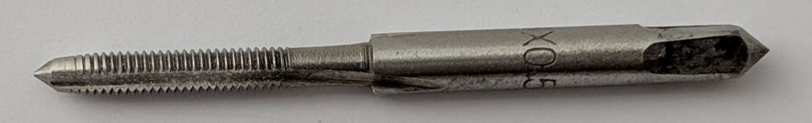

These tools will be required in addition to the [equipment for SMBee construction](../smbee/equipment.md).

For purchasing information see the [Parts and tools spreadsheet](https://docs.google.com/spreadsheets/d/1pC-4M-7qa12mT0QL2S9FdDb4QyRmq4kYofQHElQal1s/edit#gid=802410893){:target="parts"}.

Item | Image | Description
-|-|-
Tap | {:width="200px"} | An M3 Coarse (0.5mm pitch) taper-tap used to cut the threads into some of the acrylic case holes to take the nylon screws.
Tap-wrench | {:width="600px"}  | An M3 compatible tap-wrench. This wrench has a ratchet but it doesn't add much benefit over the simpler types.
Pliers | {:width="600px"} | Small pliers to remove the pins from the header pin body.
Calipers | {:width="800px"} | Digital or vernier calipers to accurately measure the acrylic thickness for laser cutting. I intend to design a gauge that can be laser cut from scrap material so these won't be necessary.

