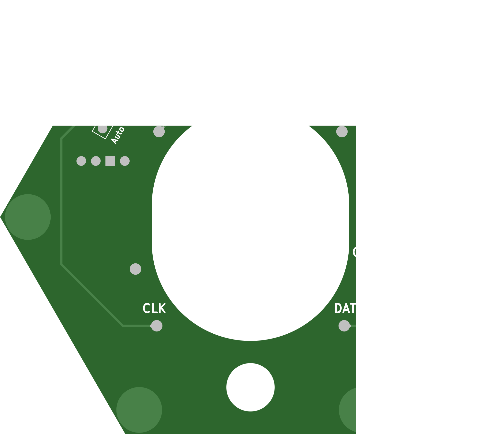
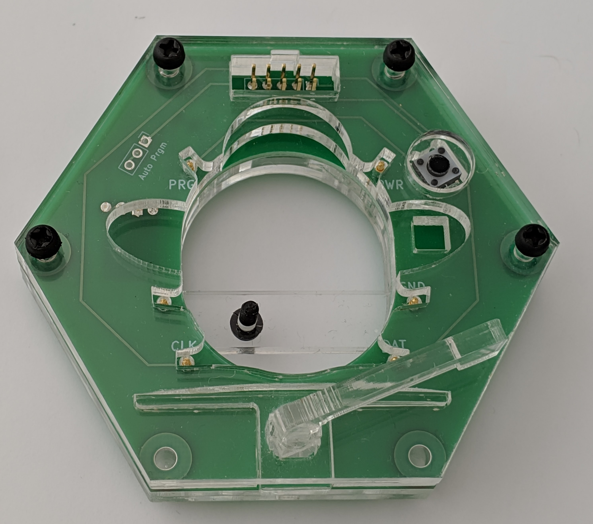
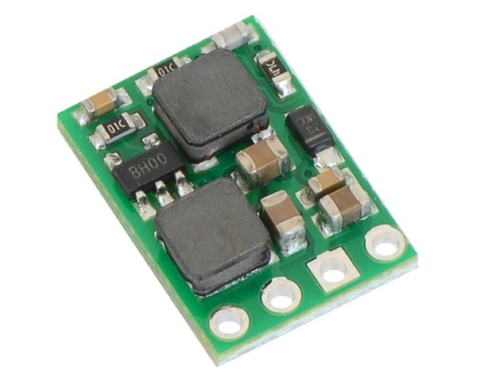
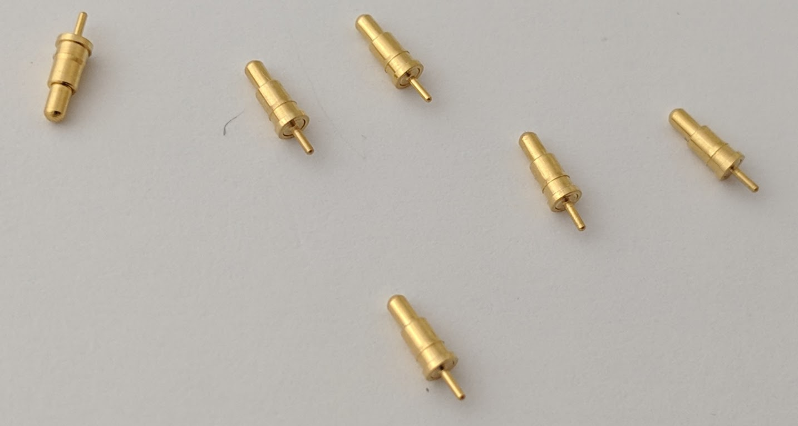
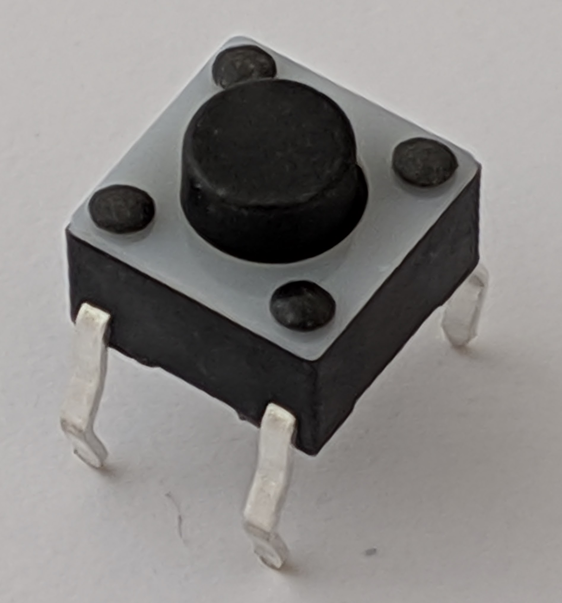
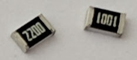
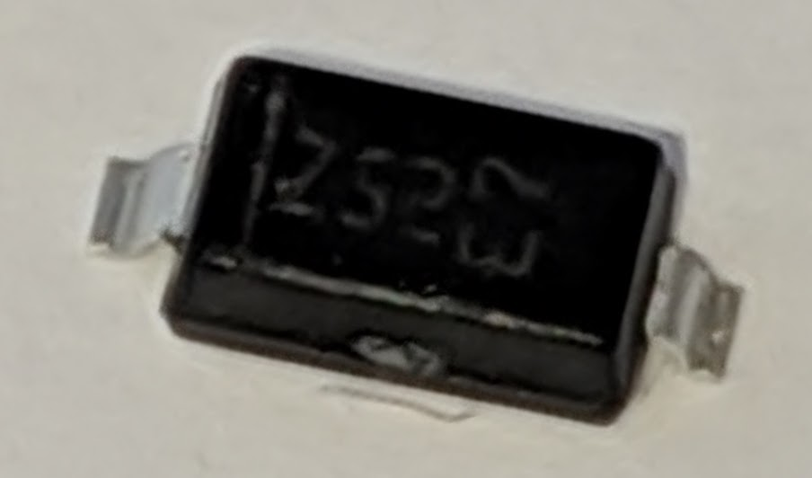
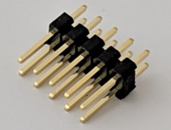
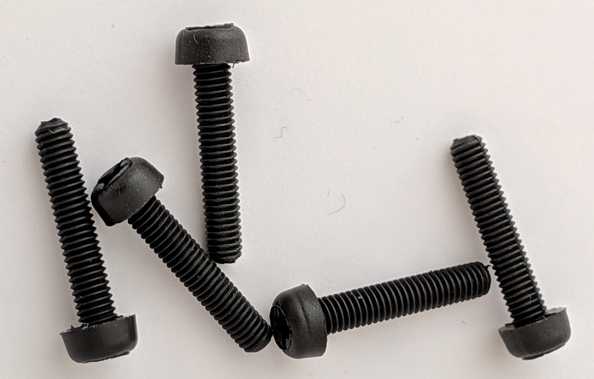
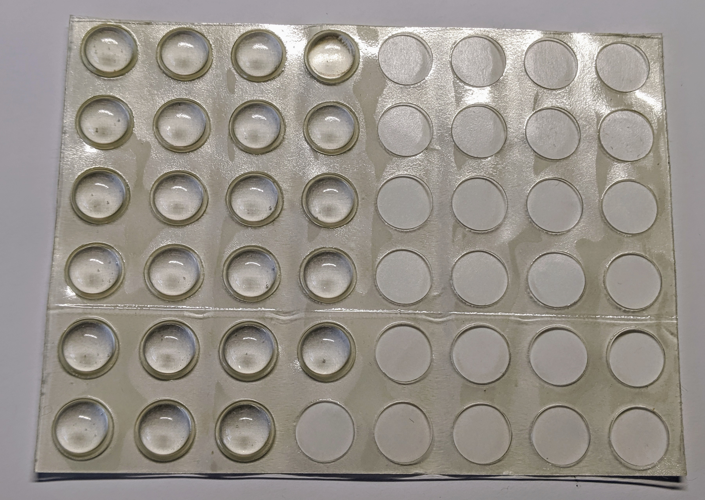

# Parts
For part codes, manufacturers, supplier and cost information see:
* [Bee Parts Spreadsheet](https://docs.google.com/spreadsheets/d/1pC-4M-7qa12mT0QL2S9FdDb4QyRmq4kYofQHElQal1s/edit#gid=258570514){:target="SMBee-spreadsheet"}.
* [PCB Suppliers & Cost Spreadsheet](https://docs.google.com/spreadsheets/d/1pC-4M-7qa12mT0QL2S9FdDb4QyRmq4kYofQHElQal1s/edit#gid=258570514){:target="SMBee-spreadsheet"}.

| Part | Image | Description
-|:-:|-
Printed Circuit Board (PCB) |  | A standard double-sided commercially manufactured PCB. Its easy to order the PCB from a manufacturer, the PCB colour is an option. See its GitHub repository: [SMBeeHive PCB](https://github.com/milelo/SMBeeHiveKiCad){:target="SMBeeHiveKiCad"}.
Laser-cut acrylic case / jig | {:width="200px"} | A custom laser cut acrylic case. See its GitHub repository [SMBeeHiveF360](https://github.com/milelo/SMBeeHiveF360){:target="SMBeeHiveF360"}.
12V DC-DC converter | {:width="100px"} | This step-up/step-down voltage regulator generates the 12V programming voltage from the 5V USB supply. Supplied with header pins.
USBASP module & cable | {:width="200px"} | An inexpensive ISP programmer. Note: this requires reprogramming to support the ATTiny10 TPI programming protocol and to control the 12V programming voltage.
Sprung contact pins | {:width="200px"} | Connects to the electrical contacts on the bees feet.
Switch | {:width="100px"} | TE FSM4JH. Single pole, single throw (SPST), normally open.
Resistors | {:width="200px"} | 2012 (0805) SMD 150mW 5% or better (1% shown).  R1: 220R. R2: 1K.
Diode D1 | {:width="100px"} | Schottky diode	for low forward volt drop.
Header pins |  | 5 x 2 header pins to connect to the USBASP module ribbon cable.
Nylon screws | {:width="200px"} | 15mm, M3 Coarse (0.5mm pitch) , nylon, pan-head screws.
Adhesive feet |  {:width="200px"} | 3.8mm stick-on feet.

