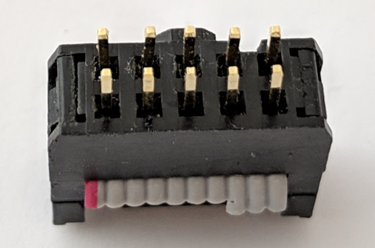

<!-- Adds class names: {: .no_toc .text-delta } -->

## Table of contents
{: .no_toc .text-delta }

1. TOC
{:toc}

---
## 12V DC-DC converter

The DC-DC converter needs to be mounted flat (and optionally stuck) onto the PCB without a gap and soldered through-hole
to the PCB with the supplied header pins which should then be trimmed short.

Place a strip of double sided kapton tape on the back. Remove the clear backing tape.| {:width="150px"}
Insert the supplied header pins (inverted) through the module and PCB. **Ensure you stick the module on the side of the PCB with the J3 label** | {:width="250px"}
Turn over, position the header (still inverted) and solder one pin, check alignment then solder the rest. | {:width="250px"}
Turn over the PCB again. With the small side-cutters snip off each pin with the plastic strip above the module. | {:width="250px"}
Solder the module to the pins. | {:width="200px"}

## Surface mount components

Apply the solder paste to the SMD pads and place the components. Ensure the diode is correctly oriented with its body line next to the D1 label. | 
Ensure particularly D1 is well seated in the paste, it can be easily dislodged by the airflow. With the hot-air station, flow the paste with the airflow directed down on top of the components. | 

## Sprung contact pins

Some precautions need to be observed when soldering the pins:
* Check each of the receiving holes on the PCB to ensure the pins fit.
* Minimize the time the heat is applied to avoid deforming the internal springs in the pins.
* While soldering the pins ensure they aren't compressed. The springs can deform and set in the compressed position.
* It is more important to ensure the pins are fully inserted into the PCB during soldering so they sit at an equal height, this is more important than ensuring they are perpendicular to the PCB.

Requirement:
* A heated soldering iron with a tinned tip.
* A soldering iron tip cleaner, a damp sponge or brass wire.
* Solder wire to tin the tip.

Add a small amount of solder paste to the three of the contact-pin pads on the top of the PCB with the contact labels. | 
Place the corresponding pins in the holes. Some of the paste will be pushed through the back of the hole. | 
Keeping the PCB in a position perpendicular to the surface so the pins are parallel to the surface, apply the tinned soldering iron tip to the back of the pads to melt the extruded paste, until a ring of melted solder appears between the pin and the PCB. | {:width="250px"}
Apply the solder paste to the other three contact pads then reposition the PCB with the unpopulated contact pads on top and repeat the pin placement and soldering. | 

## Header pins

To keep a low profile the header pins are soldered directly into the PCB without the plastic retaining strip.

With a small pair of pliers pull the header pins out of the retainer one by one. | 
Insert all the pins fully into a USBASP ribbon cable IDC socket. You can use an IDC socket attached to the supplied ribbon cable or an old socket (shown). | 
Insert the pins with the IDC connector into the **top side of the PCB on the same side as the contact pins**. Turn over, solder one of the pins and check the alignment and adjust if necessary. | 
Solder the rest of the pins. Keep the heat application time to a minimum to avoid melting the connector housing. | 
Unplug the IDC socket from the PCB to reveal the soldered pins. | 

## Switch

Press-fit the switch into the PCB on the same side as the contact pins. Turn the PCB over and solder its pins. | 

## Completed PCA

{:width="350px"} | {:width="350px"}
