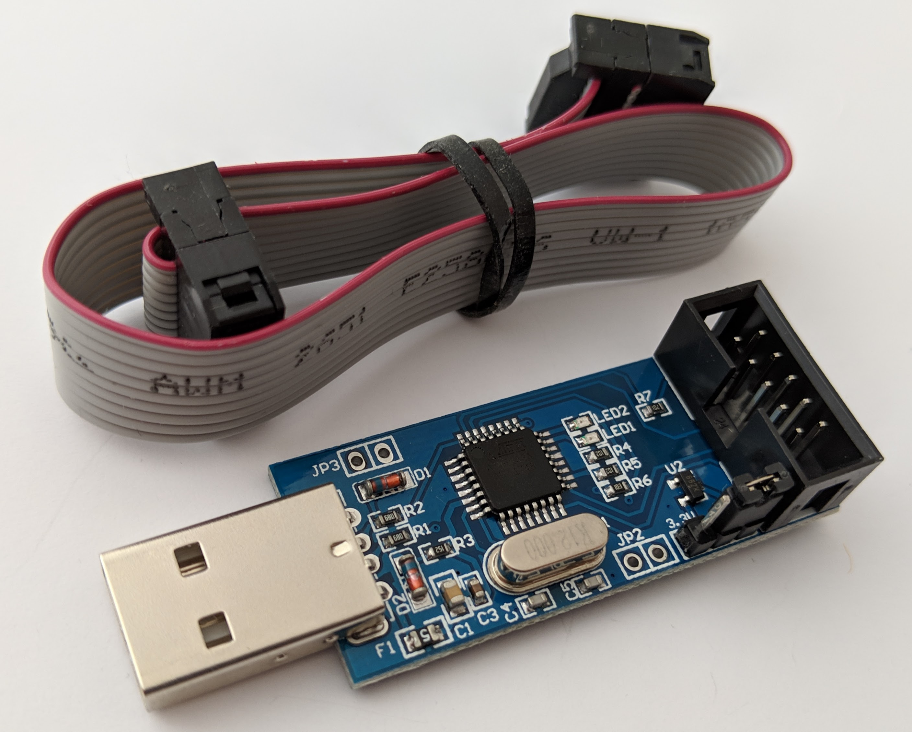

The [SMBeeHiveFirmware](https://github.com/milelo/SMBeeHiveFirmware){:target="SMBeeHiveFirmware"} repository provides full reprogramming instructions.

The USBASP Provides the main programming functionality of the SMBeeHive programmer. USBASP clones are inexpensive and readily available from [ebay]{:target="ebay"}. As supplied the module only support the ISP programming protocol, it needs to be flash programmed to change the firmware to also support the TPI protocol and control the 12v programming voltage.

A second identical module is required to perform the reprogramming. Once a modules firmware has been changed its ISP capability is still available and can be used to update other USBASP modules.

[ebay]: https://www.ebay.co.uk/sch/i.html?_odkw=USBASP&_osacat=0&_from=R40&_trksid=p2045573.m570.l1313.TR1.TRC0.A0.H0.XUSBASP+programmer.TRS0&_nkw=USBASP+programmer&_sacat=0